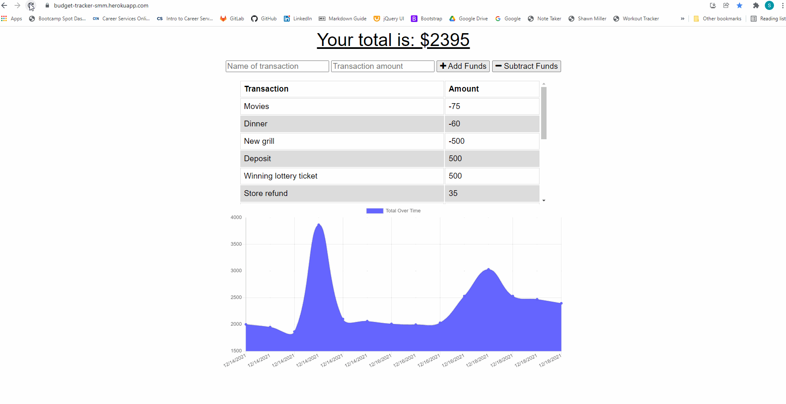

# Budget Tracker
Created by Shawn Miller

# Table of Contents
* [Description](#Description)
* [Installation](#Installation)
* [Usage](#Usage)
* [Technologies](#Technologies)
* [Appearance](#Appearance)
* [Bugs](#Bugs)
* [Contact-Info](#Contact-Info)

# Description
This app will let a user keep track of a budget. The user will be able to enter deposits and expenses on and offline. If a user is offline the app will keep checking for an online connection and add all offline entries to the online database.

# Installation
This app is deployed to Heroku (see [Usage](#Usage))

OR

The app can be run locally. First a user can clone this repository to a computer, run a "npm install" at a terminal, then run a "npm start" at the terminal and finally visit http://localhost:3000.

# Usage
This app is deployed to Heroku and can be accessed using the following link:
- https://budget-tracker-smm.herokuapp.com/

Use the following link to access the repository:
- https://github.com/Shawn52409/Budget-Tracker

# Technologies
- Node.js
- npm dotenv
- npm express
- JavaScript
- mongoose
- mongodb
- mongodb atlas
- Heroku

# Appearance
## App working online

## App working offline then back online

# Bugs
No known bugs

# Contact-Info
shawnsmm@gmail.com

github.com/Shawn52409

www.linkedin.com/in/shawn-miller-b44a36217